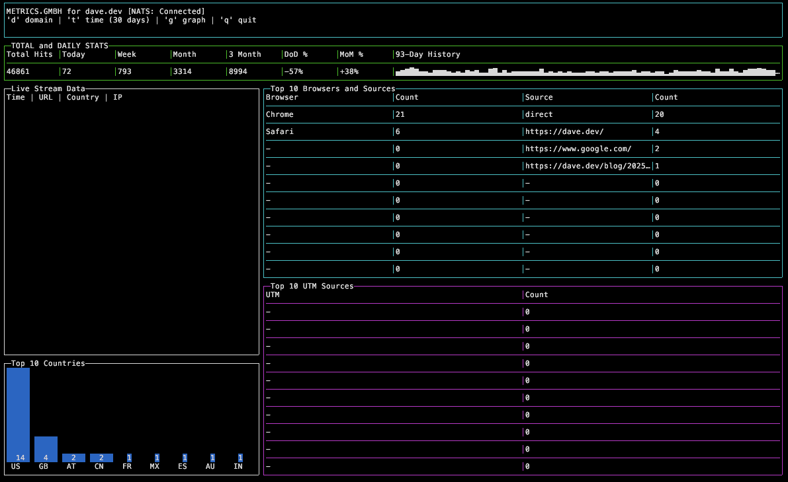
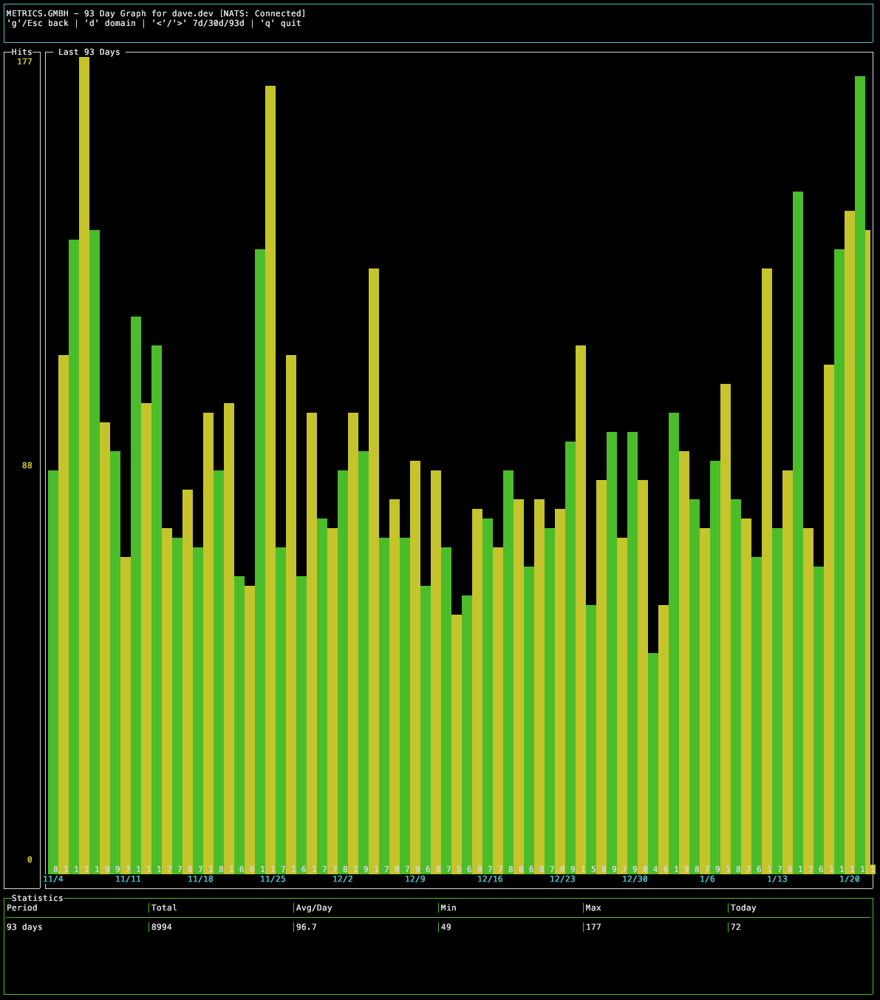

# Metrics GmbH

A privacy-focused, self-hosted web analytics platform built on [NATS](https://nats.io).





## Architecture

```
┌─────────────┐     ┌─────────────┐     ┌─────────────────┐
│   Browser   │────▶│     API     │────▶│      NATS       │
│  (tracker)  │     │  (Go HTTP)  │     │   (JetStream)   │
└─────────────┘     └─────────────┘     └────────┬────────┘
                                                 │
                                        ┌────────▼────────┐
                                        │   Terminal UI   │
                                        │   (Dashboard)   │
                                        └─────────────────┘
```

## Components

| Component | Description |
|-----------|-------------|
| [**api**](https://github.com/metrics-gmbh/api) | HTTP service that receives web visit events and stores them in NATS |
| [**terminal-ui**](https://github.com/metrics-gmbh/terminal-ui) | Real-time terminal dashboard for viewing analytics |
| [**js**](https://github.com/metrics-gmbh/js) | Lightweight JavaScript tracker for websites |

## Quick Start

1. **Set up NATS** - See [NATS Setup](#nats-setup) below
2. **Deploy the API** - Receives events from your websites
3. **Add the tracker** - Include the JS snippet on your site
4. **View analytics** - Run the terminal dashboard

## NATS Setup

Metrics GmbH uses NATS JetStream for message streaming and KV stores for state.

### Prerequisites

- NATS Server with JetStream enabled
- NATS CLI (`nats` command)

### Create KV Stores

```bash
# Account store - holds account/subscription data
nats kv add metrics_accounts

# Domain store - maps domains to accounts
nats kv add metrics_domains

# 93-day rolling window store (auto-expires old data)
nats kv add metrics_domains93days --ttl 93d
```

### Create Yearly Stream

Create a new stream each year for web visit events:

```bash
# For 2026 (adjust year as needed)
nats stream add metrics_webvisit_26 \
  --subjects "metrics.webvisit.*.26.>" \
  --storage file \
  --replicas 1 \
  --retention limits \
  --max-bytes 10GB \
  --discard old \
  --dupe-window 2m
```

### Seed Initial Data

Create an account:

```bash
# Generate a UUID for your account
ACCOUNT_UUID=$(uuidgen | tr '[:upper:]' '[:lower:]')

# Create account record
nats kv put metrics_accounts "$ACCOUNT_UUID" '{
  "account": "'$ACCOUNT_UUID'",
  "email": "you@example.com",
  "password": "your-password-hash",
  "signup_date": "2025-01-01",
  "sub_end": "2026-01-01",
  "domains": ["example.com"],
  "max_domains": 100,
  "hits": 0,
  "max_hits": 100000
}'
```

Register a domain:

```bash
nats kv put metrics_domains "example.com" '{
  "domain": "example.com",
  "account": "'$ACCOUNT_UUID'",
  "hits": 0
}'
```

## License

Apache 2.0 - See [LICENSE](./LICENSE)

## Author

David Gee <me@dave.dev>
